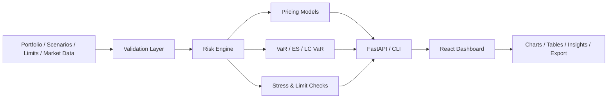
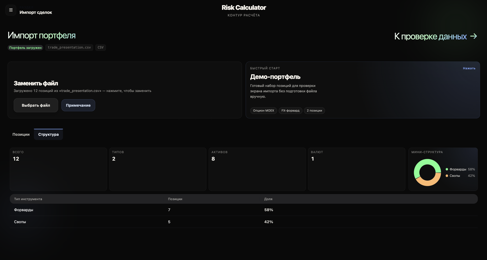
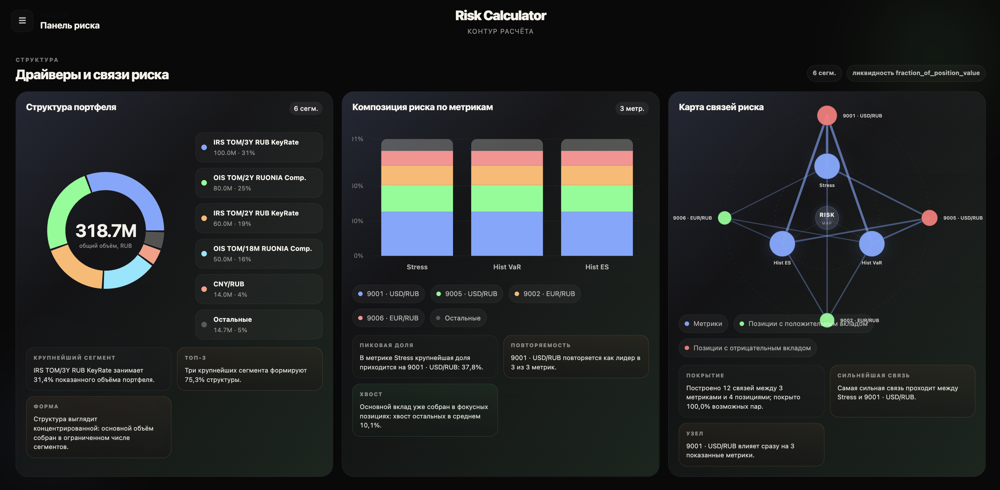

<div align="center">

# Risk Calculator for MOEX SPFI
### Риск‑калькулятор для рынка стандартизированных ПФИ Московской биржи

<p>
  
  
  
  
  
</p>

<p>
  Веб‑платформа для <b>загрузки рыночных данных</b>, <b>оценки деривативов</b>, <b>расчёта VaR / ES / Greeks / stress metrics</b>
  и <b>анализа риска портфеля</b> с современным визуальным интерфейсом, экспортом отчётов и API‑слоем.
</p>

</div>

---

## ✨ О проекте

**Risk Calculator for MOEX SPFI** — это учебный, но уже весьма инженерный проект, который превращает набор рыночных данных и сделок в понятную систему анализа портфельного риска.

Проект покрывает весь пользовательский путь:
- импорт портфеля и сценариев;
- валидацию структуры и качества данных;
- загрузку market data bundle;
- запуск расчётов через backend/CLI/API;
- просмотр результата в веб‑интерфейсе;
- анализ лимитов, стрессов, маржи, вкладов позиций и what‑if сценариев;
- экспорт отчётов в удобные форматы.

Это не просто «калькулятор формул», а **полноценный каркас risk analytics platform** с разделением на frontend, backend, datasets, документацию и тесты.

---

## 🔥 Что уже умеет система

<table>
  <tr>
    <td width="50%" valign="top">
      <h3>📈 Pricing & Analytics</h3>
      <ul>
        <li>Black–Scholes для европейских опционов</li>
        <li>CRR binomial model для европейских и американских опционов</li>
        <li>Monte Carlo для европейских опционов</li>
        <li>Поиск implied volatility (Newton + bisection)</li>
        <li>Greeks: Delta, Gamma, Vega, Theta, Rho</li>
        <li>Численные sensitivities и вклад позиций</li>
      </ul>
    </td>
    <td width="50%" valign="top">
      <h3>⚠️ Risk Engine</h3>
      <ul>
        <li>Historical / scenario-based VaR & ES</li>
        <li>Parametric VaR & ES</li>
        <li>Cornish–Fisher tail adjustment</li>
        <li>LC VaR / liquidity add-on</li>
        <li>Stress testing и limit breach highlighting</li>
        <li>Margin / capital related outputs</li>
      </ul>
    </td>
  </tr>
  <tr>
    <td width="50%" valign="top">
      <h3>🧩 Data & Validation</h3>
      <ul>
        <li>Импорт CSV / JSON</li>
        <li>Валидация дат, валют ISO 4217, quantity, volatility, price</li>
        <li>Поддержка scenario files и limits JSON</li>
        <li>Обработка trade-export CSV с русскими колонками</li>
        <li>Журнал ошибок и validation log</li>
        <li>Bootstrapping market data bundle</li>
      </ul>
    </td>
    <td width="50%" valign="top">
      <h3>🖥️ Product & UX</h3>
      <ul>
        <li>React + TypeScript интерфейс</li>
        <li>Многошаговый wizard workflow</li>
        <li>Drag & Drop импорт</li>
        <li>Светлая / тёмная тема</li>
        <li>Интерактивные графики и dashboard insights</li>
        <li>Экспорт CSV / Excel / JSON</li>
      </ul>
    </td>
  </tr>
</table>

---

## 🧭 Пользовательский сценарий

```text
S1 Import → S2 Validate → S3 Market Data → S4 Configure → S5 Run → S6 Dashboard
                                              ↘ Stress / Limits / Margin / Export / What-if
```

Идея интерфейса в том, чтобы пользователь не просто «запустил расчёт», а проходил понятный сценарий работы с риском: от данных к выводам.

---

## 🏗️ Архитектура



### Основные слои

- **Frontend** — пользовательский интерфейс, шаги workflow, графики, UX-подсказки, экспорт.
- **Backend** — risk engine, API, обработка портфеля и сценариев, расчёты и сериализация результатов.
- **CLI** — запуск расчётов из командной строки и генерация файловых отчётов.
- **Docs** — план, заметки, трассируемость требований.
- **Datasets** — примеры входных файлов и наборы для тестирования/демо.

---

## 🧪 Технологический стек

### Backend
- Python
- FastAPI
- NumPy
- Pandas
- SciPy
- Matplotlib
- Pydantic
- pytest

### Frontend
- React
- TypeScript
- Vite
- React Router
- TanStack Query
- HeroUI
- Tailwind CSS
- ECharts
- Recharts
- Zod
- PapaParse
- xlsx

### Testing
- pytest
- Jest + React Testing Library
- Playwright
- Vitest

---

## 📁 Структура репозитория

```bash
.
├── backend/           # Risk engine, CLI, FastAPI API, tests, outputs
│   ├── option_risk/
│   ├── tests/
│   └── requirements.txt
├── frontend/          # React + TypeScript UI
│   ├── src/
│   │   ├── api/
│   │   ├── components/
│   │   ├── pages/
│   │   ├── workflow/
│   │   ├── state/
│   │   └── validation/
│   └── package.json
├── docs/              # План, примечания, traceability
├── datasets/          # Примеры входных файлов и market data
├── run_all.sh         # Скрипт единого запуска проекта
└── README.md
```

---

## 🚀 Быстрый старт

### Вариант 1. Запуск всего проекта одной командой

```bash
bash run_all.sh
```

Что делает скрипт:
- создаёт виртуальное окружение;
- ставит Python-зависимости;
- прогоняет backend tests;
- запускает demo CLI pipeline;
- поднимает FastAPI на `:8000`;
- поднимает Vite frontend на `:5173`.

---

### Вариант 2. Backend отдельно

```bash
python -m venv .venv
source .venv/bin/activate   # Windows: .venv\Scripts\activate
pip install -r backend/requirements.txt

cd backend
PYTHONPATH=. pytest tests -q
PYTHONPATH=. uvicorn option_risk.api:app --reload
```

---

### Вариант 3. CLI расчёт с примерами

```bash
cd backend
PYTHONPATH=. python -m option_risk.cli \
  --portfolio ../datasets/examples/portfolio.csv \
  --scenarios ../datasets/examples/scenarios.csv \
  --limits ../datasets/examples/limits.json \
  --output ../backend/output
```

После запуска вы получите:
- `csv/*.csv`
- `report.xlsx`
- `report.json`
- `pnl_hist.png`

---

### Вариант 4. Frontend отдельно

```bash
cd frontend
npm install
npm run dev
npm test
npm run build
```

Полезные страницы:
- `http://localhost:5173/` — основной интерфейс
- `http://localhost:5173/ui-demo` — проверка layout / UI элементов
- `http://localhost:5173/portfolio` — просмотр текущего портфеля

> По умолчанию frontend может работать в demo-режиме. Для подключения к API используется `VITE_DEMO_MODE=0`.

---

## 🔌 API

Ключевые backend endpoints:

```text
POST /metrics
POST /market-data/session
GET  /market-data/{session_id}
POST /market-data/upload
POST /market-data/load-default
GET  /scenarios
GET  /health
```

API слой позволяет использовать risk engine не только через UI, но и как отдельный интеграционный сервис.

---

## 📦 Форматы входных данных

### Портфель
Поддерживаются `CSV` и `JSON`.

Примеры полей:
- `instrument_type`
- `position_id`
- `quantity`
- `underlying_symbol`
- `underlying_price`
- `strike`
- `volatility`
- `maturity_date`
- `valuation_date`
- `risk_free_rate`
- `currency`

### Сценарии
Поддерживаются `CSV` и `JSON`.

Примеры полей:
- `scenario_id`
- `underlying_shift`
- `volatility_shift`
- `rate_shift`
- `probability`

### Лимиты
Поддерживается `JSON` c лимитами для метрик риска и стресс‑сценариев.

---

## 📊 Что получает пользователь на выходе

После расчёта система формирует:
- ключевые risk metrics по портфелю;
- стресс‑таблицы и проверку breach по лимитам;
- PnL distribution;
- Greeks и sensitivity breakdown;
- визуальные dashboard‑insights;
- экспортные файлы для дальнейшего анализа.

---

<p align="center">
  
</p>
<p align="center">
  
</p>

---

## 👨‍💻 Авторы

**Kirill Voyakin & Sazonov Oleg**
---

<div align="center">

### ⭐ Если проект тебе нравится — поставь звезду репозиторию

**From formulas to product. From calculations to decisions.**

</div>