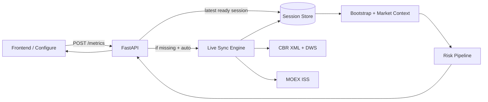
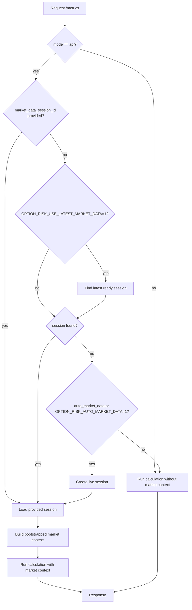
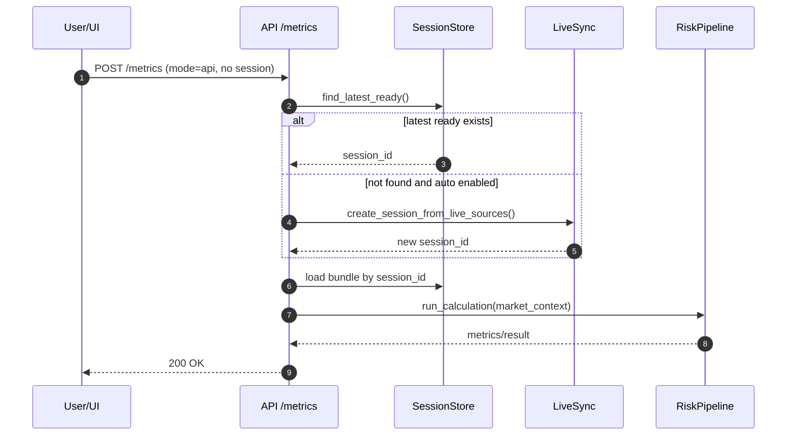

# Live Market Data API: что сделано и как это работает

Документ описывает реализацию live-подтяжки рыночных данных (ЦБ + MOEX), автоподхват market data в расчётах и операционную обвязку (health-check, cron/systemd).

## 1. Цель изменений

Было:
- расчёт `POST /metrics` в `mode=api` использовал рыночные данные только если передан `market_data_session_id`;
- иначе приходилось вручную загружать bundle через `/market-data/upload`.

Стало:
- можно работать без ежедневной ручной загрузки;
- backend умеет:
1. брать **последнюю готовую** session автоматически;
2. при необходимости делать **live sync на лету**;
3. отдавать health свежести market data;
4. запускаться по расписанию (cron/systemd).

---

## 2. Какие компоненты добавлены

### Backend
- `backend/option_risk/data/live_market_data.py`
  - live-загрузка данных из источников:
    - ЦБ: `XML_dynamic.asp`, `DailyInfoWebServ/DailyInfo.asmx` (SOAP `RuoniaXML`, `KeyRateXML`);
    - MOEX ISS: history по FX-инструментам.
  - сборка совместимого bundle:
    - `curveDiscount.xlsx`
    - `curveForward.xlsx`
    - `fixing.xlsx`
    - `RC_*.xlsx` (FX history)

- `backend/option_risk/data/market_data_sessions.py`
  - создание session из live-источников;
  - поиск последней `ready` session;
  - экспорт `get_market_data_session_dir(...)` для health-аналитики.

- `backend/option_risk/api.py`
  - `POST /metrics` расширен:
    - поле `auto_market_data: bool`;
    - логика автоподхвата `latest ready`;
    - логика авто-создания live-session.
  - новый endpoint: `POST /market-data/sync-live`
  - новый endpoint: `GET /market-data/health`

- Скрипты:
  - `backend/scripts/sync_live_market_data.py`
  - `backend/scripts/check_market_data_health.py`

- Deploy шаблоны:
  - `backend/deploy/systemd/option-risk-market-sync.service`
  - `backend/deploy/systemd/option-risk-market-sync.timer`
  - `backend/deploy/cron/option-risk-market-sync.cron`

### Frontend
- `frontend/src/api/endpoints.ts`
  - в payload `/metrics` добавлено поле `auto_market_data?: boolean`.
- `frontend/src/api/services/risk.ts`
  - если не выбран `marketDataSessionId`, отправляется `auto_market_data=true` (по `VITE_AUTO_MARKET_DATA`).

---

## 3. Архитектура (высокоуровнево)



---

## 4. Поток обработки в `POST /metrics`



### Порядок приоритета источника market data
1. Явно переданный `market_data_session_id`.
2. Последняя `ready` session (если разрешено env-переменной).
3. Live sync на лету (если включён авто-режим).
4. Если ничего не найдено и авто выключен — расчёт идёт без market context.

---

## 5. Новые и обновлённые API контракты

## 5.1 `POST /metrics` (расширение)

### Новое поле запроса
- `auto_market_data: boolean = false`

### Смысл
- если `market_data_session_id` не задан:
  - backend может автоматически взять последнюю session;
  - либо создать live session (если разрешено).

### Минимальный пример
```json
{
  "positions": [...],
  "scenarios": [...],
  "mode": "api",
  "auto_market_data": true
}
```

---

## 5.2 `POST /market-data/sync-live`

Создаёт новую session, тянет live данные и сохраняет bundle в session storage.

### Request
```json
{
  "as_of_date": "2026-04-22",
  "lookback_days": 180
}
```

`as_of_date` опционален (по умолчанию `today`), `lookback_days` по умолчанию `180`.

### Response (пример)
```json
{
  "session_id": "3ef3f50fc67443ea87f76bb141c078d8",
  "ready": true,
  "blocking_errors": 0,
  "warnings": 1,
  "missing_required_files": [],
  "counts": {
    "discount_curves": 10,
    "forward_curves": 40,
    "fixings": 303,
    "calibration_instruments": 0,
    "fx_history": 241
  }
}
```

---

## 5.3 `GET /market-data/health?max_age_days=1`

Проверяет, насколько свежая последняя `ready` session.

### Response (ok)
```json
{
  "ok": true,
  "reason": "ok",
  "now": "2026-04-22",
  "latest_session_id": "8be3693dee984f2e9a2b7206e6670d2f",
  "latest_session_mtime": "2026-04-21T17:15:06.746009+00:00",
  "age_days": 0,
  "max_age_days": 2
}
```

### Response (not ok)
```json
{
  "ok": false,
  "reason": "stale_market_data",
  "now": "2026-04-22",
  "latest_session_id": "abc123",
  "age_days": 3,
  "max_age_days": 1
}
```

---

## 6. Какие данные тянутся и как преобразуются

### Источники
- ЦБ:
  - `XML_dynamic.asp` (FX history)
  - SOAP DWS:
    - `KeyRateXML`
    - `RuoniaXML`
- MOEX ISS:
  - FX history (для части валют, board `CETS`).

### Внутреннее преобразование
- Из ключевой ставки строится `RUB-DISCOUNT-RUB-CSA` (узлы теноров).
- Из key rate + RUONIA строятся forward curves:
  - `RUB-CBR-KEY-RATE`
  - `RUB-RUONIA-OIS-COMPOUND`
  - `RUB-RUSFAR-OIS-COMPOUND`
  - `RUB-RUSFAR-3M`
- Из time series формируется `fixing.xlsx` для индексов:
  - `RUB KEYRATE`
  - `RUONIA`
  - `RUSFAR RUB O/N`
  - `RUSFAR RUB 3M`
- FX история складывается в `RC_USD.xlsx`, `RC_EUR.xlsx`, `RC_CNY.xlsx`.

### Формат файлов (совместимость с текущим loader)
- `curveDiscount.xlsx`:
  - `Дата, Кривая, Тип, Дисконт фактор, Тенор, Ставка`
- `curveForward.xlsx`:
  - `Дата, Кривая, Тип, Срок, Тенор, Ставка`
- `fixing.xlsx`:
  - `Индекс, Фиксинг, Дата`

---

## 7. Диаграмма sequence: ручной и авто режим



---

## 8. Переменные окружения

- `OPTION_RISK_USE_LATEST_MARKET_DATA` (default `1`)
  - использовать последнюю готовую session, если `market_data_session_id` не передан.

- `OPTION_RISK_AUTO_MARKET_DATA` (default `0`)
  - если ready-session не найдена, создать live-session автоматически.

- `OPTION_RISK_AUTO_MARKET_LOOKBACK_DAYS` (default `180`)
  - глубина истории для live sync.

- `OPTION_RISK_MARKET_SESSION_ROOT`
  - каталог хранения session с market data.

- `VITE_AUTO_MARKET_DATA` (frontend, default `1`)
  - отправлять `auto_market_data=true` при отсутствии выбранного session id.

---

## 9. Операционный запуск (ежедневно)

## 9.1 CLI вручную
```bash
cd backend
PYTHONPATH=. python3 scripts/sync_live_market_data.py --lookback-days 180
PYTHONPATH=. python3 scripts/check_market_data_health.py --max-age-days 1
```

## 9.2 systemd
Файлы:
- `deploy/systemd/option-risk-market-sync.service`
- `deploy/systemd/option-risk-market-sync.timer`

Логика:
1. По расписанию запускает daily sync.
2. После sync делает health-check.

## 9.3 cron
Файл:
- `deploy/cron/option-risk-market-sync.cron`

Задача:
- будни в `07:10` локального времени сервера.

---

## 10. Тестирование, которое добавлено/выполнено

Добавлен test module:
- `backend/tests/test_market_data_auto_api.py`
  - health: отсутствие sessions;
  - health: stale session;
  - `/metrics` auto sync путь.

Локальный статус последнего прогона:
- `backend pytest`: `64 passed, 4 skipped`.

---

## 11. Ограничения и что важно для production

1. Источники публичные и могут быть delayed/без SLA.
2. Для коммерческого использования рыночных данных возможны лицензионные требования (особенно MOEX).
3. Forward/discount в live sync сейчас строятся программно по базовой логике для совместимости с текущим движком; это рабочий operational baseline, но не замена полноценной desk-калибровке по торговым инструментам.
4. Нужны мониторинг и алерты:
   - падение sync;
   - stale health;
   - аномальные точки в кривых/fixings.

---

## 12. Быстрый troubleshooting

- `market-data/health -> no_ready_sessions`
  - не было успешного sync, запустить `sync_live_market_data.py`.

- `market-data/health -> stale_market_data`
  - sync давно не запускался или падал, проверить timer/cron и логи.

- `sync-live` возвращает `502`
  - недоступен внешний источник (ЦБ/MOEX) или сеть.

- `/metrics` без market context
  - проверить:
    - `mode="api"`;
    - env `OPTION_RISK_USE_LATEST_MARKET_DATA`;
    - env `OPTION_RISK_AUTO_MARKET_DATA`;
    - наличие ready session.

---

## 13. Ключевые файлы реализации

- `backend/option_risk/api.py`
- `backend/option_risk/data/live_market_data.py`
- `backend/option_risk/data/market_data_sessions.py`
- `backend/scripts/sync_live_market_data.py`
- `backend/scripts/check_market_data_health.py`
- `backend/deploy/systemd/option-risk-market-sync.service`
- `backend/deploy/systemd/option-risk-market-sync.timer`
- `backend/deploy/cron/option-risk-market-sync.cron`
- `backend/tests/test_market_data_auto_api.py`
- `frontend/src/api/endpoints.ts`
- `frontend/src/api/services/risk.ts`

